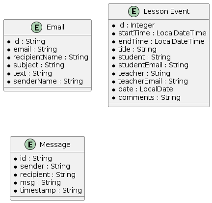
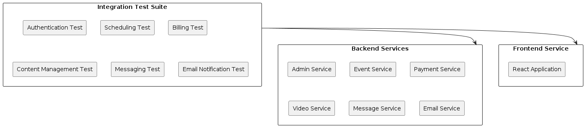

# SPEC: Integration Test Suite for Turbolessons

## Background

>  Turbolessons is designed for music teachers to manage their teaching activities effectively. It includes functionalities
>  for billing students, scheduling lessons, and uploading documents and video content. The backend is built using Spring Boot,
>  providing RESTful services consumed by a React-based frontend. The architecture comprises several microservices,
>  each with a specific responsibility:
>
>  - `config-server`: A Spring Cloud Config Server for centralized configuration management.
>  - `service-registry`: A Eureka server for service discovery.
>  - `api-gateway`: A Spring Cloud Gateway service for routing and load balancing.
>  - `admin-service`: Manages authentication and user management using Okta as the identity provider.
>  - `event-service`: Manages lesson schedules.
>  - `message-service`: A WebSocket chat server for messaging.
>  - `email-service`: A background email server for sending scheduled reminders and notifications.
>  - `video-service`: Interfaces with Google Cloud Storage to serve video data.
>  - `payment-service`: Integrates with Stripe for managing subscription-based billing.
>  - `turbolessons-frontend`: A React application serving as the frontend.
>
>  The integration test suite aims to ensure seamless interaction between these components and the frontend, validating end-to-end functionality.
---

## Requirements

>  *Must Have*:
>  - Test user authentication and authorization workflows handled by `admin-service`.
>  - Verify scheduling functionalities, including creating, updating, and deleting lessons in `event-service`.
>  - Ensure billing processes are accurate and reliable in `payment-service`.
>  - Validate document and video content upload and access via `video-service`.
>  - Test messaging functionalities in `message-service`.
>  - Verify email notifications and reminders sent by `email-service`.
>  - Ensure proper routing and load balancing through `api-gateway`.
>  - Test configuration management and service discovery via `config-server` and `service-registry`.
>
>  *Should Have*:
>  - Verify the integration between frontend and backend for real-time updates.
>  - Test user interface consistency and functionality across different browsers.
>
>  *Could Have*:
>  - Performance testing for key functionalities under load.
>  - Automated tests for security vulnerabilities.
>
>  *Won't Have*:
>  - Manual testing for exploratory purposes.
---

## Method

>  The integration test suite will be developed using JUnit5 for unit testing, TestNG for integration testing, and Selenium
>  for functional testing. The tests will be integrated into the existing CI/CD pipeline managed by GitHub Actions and Jenkins.
---

### Architecture Design

>  The integration tests will follow a layered architecture to separate concerns and enhance maintainability. The main layers are:
>
>  - **Test Setup Layer**: Configures the testing environment, including initializing Spring contexts, setting up test data,
>  - and configuring mock servers.
>  - **Test Execution Layer**: Executes the tests, including backend REST API tests, frontend UI tests, and end-to-end tests.
>  - **Test Verification Layer**: Verifies the test results, ensuring that the application behaves as expected.
>
>  The following diagram illustrates the architecture of the integration test suite:  
>
>  ---
> 
>  
>
> ---

### Database Schemas

>  The integration tests will use an in-memory H2 database to simulate the production database for SQL-based entities and
>  an embedded MongoDB instance for NoSQL-based entities. The schema will mirror the production database schema to ensure
>  accurate testing. Here are example schemas for key tables:
>
>  ---
>  
>
> ---  

### Algorithms

>  The integration tests will include the following key algorithms:
>
>  - **Authentication Flow**: Tests user login, token validation, and access control using mock Okta responses.
>  - **Lesson Scheduling**: Tests creating, updating, and deleting lessons, including conflict detection.
>  - **Billing Process**: Tests subscription creation, payment processing, and invoice generation using mock Stripe responses.
>  - **Content Management**: Tests uploading, retrieving, and deleting documents and videos.
>  - **Messaging**: Tests real-time messaging via WebSocket.
>  - **Email Notifications**: Tests scheduled email reminders and notifications.
> ---  

### Component Diagrams

>  The following component diagram illustrates the interaction between the main services and the integration test suite:
>
>  
---  

## Implementation

>  1. **Setup Testing Frameworks**:
>    - Configure JUnit5 for unit tests.
>    - Configure TestNG for integration tests.
>    - Setup Selenium for frontend functional tests.
>    - Integrate tests with GitHub Actions and Jenkins for CI/CD.
>
>  2. **Develop Test Cases**:
      >    - Create test cases for user authentication and authorization using `admin-service`.
>    - Develop tests for lesson scheduling functionalities in `event-service`.
>    - Implement tests for billing processes using `payment-service`.
>    - Write tests for document and video content management via `video-service`.
>    - Create tests for messaging functionalities in `message-service`.
>    - Verify email notifications and reminders sent by `email-service`.
>
>  3. **Configure Test Environment**:
      >    - Setup in-memory H2 database and embedded MongoDB with schemas mirroring production.
>    - Configure mock servers for external dependencies (e.g., Okta, Stripe).
>
>  4. **Execute and Verify Tests**:
      >    - Run tests in the CI/CD pipeline using GitHub Actions and Jenkins.
>    - Verify test results and address any failures.
>    - Continuously update tests as the application evolves.
>
>  5. **Documentation and Maintenance**:
      >    - Document the test cases and setup procedures.
>    - Regularly maintain and update the test suite to accommodate new features and changes.
---  

## Milestones

>  1. **Milestone 1: Setup Testing Frameworks**
      >    - Duration: 1 week
>    - Deliverables: Configured JUnit5, TestNG, Selenium, and CI/CD integration.
>
>  2. **Milestone 2: Develop Initial Test Cases**
      >    - Duration: 2 weeks
>    - Deliverables: Initial set of test cases for core functionalities (authentication, scheduling, billing).
>
>  3. **Milestone 3: Configure Test Environment**
      >    - Duration: 1 week
>    - Deliverables: Configured in-memory database and mock servers.
>
>  4. **Milestone 4: Execute and Verify Tests**
      >    - Duration: 2 weeks
>    - Deliverables: Test execution reports, issue resolutions.
>
>  5. **Milestone 5: Documentation and Maintenance**
      >    - Duration: Ongoing
>    - Deliverables: Comprehensive documentation, regular updates.
---

## Gathering Results

>  To evaluate whether the requirements were addressed properly and assess the performance of the system post-production, the following steps will be taken:
>
>  1. **Test Coverage Analysis**:
      >    - Ensure all critical user journeys are covered by the tests.
>    - Use coverage tools to measure and report the extent of test coverage.
>
>  2. **Performance Metrics**:
      >    - Collect performance data during test execution.
>    - Compare results against predefined performance criteria.
>
>  3. **User Feedback**:
      >    - Gather feedback from users and stakeholders on the stability and reliability of the application post-testing.
>
>  4. **Continuous Improvement**:
      >    - Regularly review and update the test suite based on new requirements and feedback.
>    - Implement additional tests as new features are added to the application.
---  